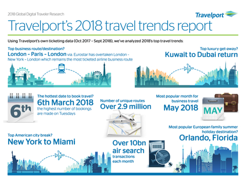
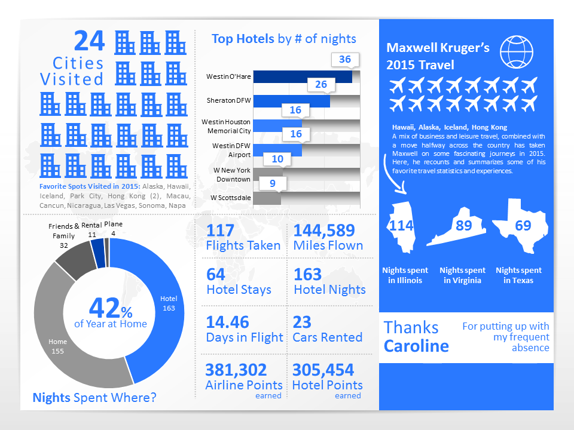

# Speech Project

Our speech will be show to product owners and businessman. For start we provide the next structure:

## 1. History telling

Alice is a travel girl. All month she fly to other countries for work and never has time to prepare the plans for travel.
 > \- What are you doing Alice?? 

 > \- I don't know... 

 > \- Wait! I have the solution

 > \- Look **myment**!!

 Then Alice go to **myment** !!! 
 ##### And go fast !!
 You don't need to fill absurds forms with your data, or data for other bussines, you only go to *myment.me* and activate the **GPS**. Myment only ask you three tags for filter your preference and **WALA**! You can take the itinerarie for explore, enjoy and life new real experiences share by native people on your live cities, towns and hotels.

 But Is this viable ? 

## 2. Stats show

We go to different API's of open data on different countries like San Francisco, London and New York and studies this cases. When the people travel for work is too normal, the 80% of the people sleep on the airport on scales and lost a lot of time and not consuming on the local market and not promoting the local bussines. 

This app can be a social and sharing without direct benefits, but in the indirect relations we can provide connections and relations with bussiness. 

The necesity of this connections are real, and the social app and share knowledge are a super value for society and for bussiness inteligence and market more real and fair markets.
Zones and local manners provide a lot of secrets things that can be a new oportunities of business.

## 3. Show solution that provide our service

You can take one mini travel inside a travel. All people enjoy with new knowledge and discovers new things. We can provide a tool for share and develop networks based on locations and locals manners. You can enjoy and discover without any effort and you can invite other people to share your secret in your city. 
This extra are much easy, much fast and much inspiratory. 

- Simple
- Rapid
- Intuitive

## 4. How we do it 

We use the following technologies:
- FrontEnding
    1. Vue 
    2. Vuex 
    3. JWT 
    4. Axios 
- BackEnding
    5. Docker 
    6. Heroku 
    7. Digital Ocean 
    8. Express 
    9. Node 
    10. MariaDB 
- Commons
    11. TypeScript 
    12. Jest 
    13. VueTest 
    14. Travis 

In total 14 technologies and maybe in the future more. Our work are in the profundization on this technologies and maybe incorporate in the future news for new functionalities.

## 5. Interactional demo

Here will be a video demo for that

## 6. How present the future of service

The intentions of this work are educational, but in the future we think on integrate new functionalities with passport libraries for OAUTH integrations and develop a bigger API for developers and grow the app on the open source enviroment. This is an altruist point of view on the travel context. Follow our steps for connecting the world in a better manner.